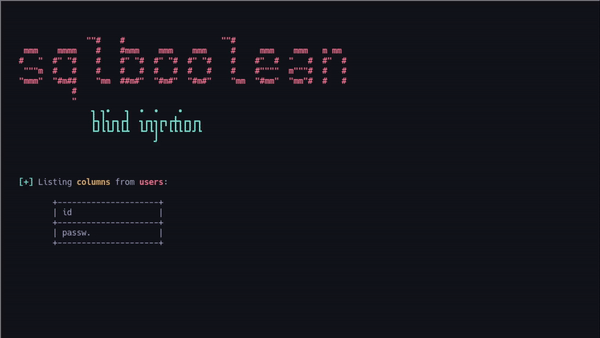
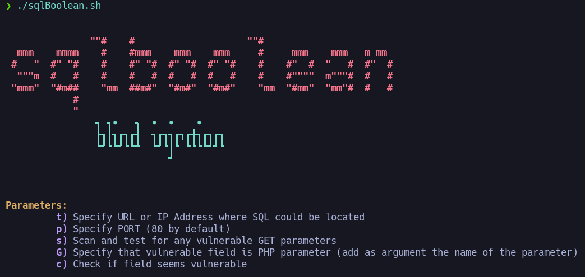
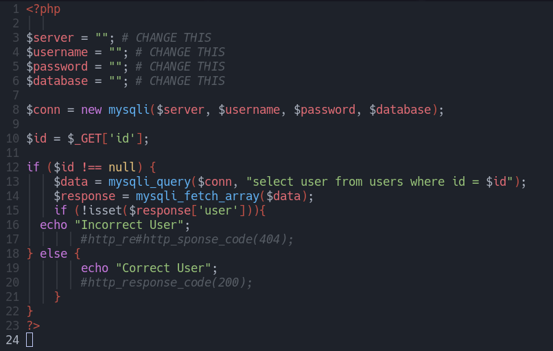
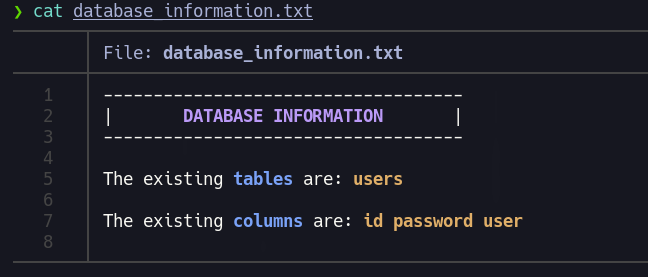

# PoC - Database Dumping Exploiting SQL Boolean Blind Injection

<!---
Lenguaje: Bash
-->     

## What is SQL Boolean Blind Injection and How Does It Work? 

A SQL Boolean Blind Injection is a type of SQL injection categorized as "blind" because the attacker cannot directly view the data returned by the server. Instead, the attacker manipulates the SQL query to create a boolean condition that results in a "true" or "false" response. These responses can be indirectly observed through specific indicators, such as the HTTP status code, the Content-Length of the server's response, or even visible messages on the web page. By leveraging these boolean signals, the attacker can perform iterative tests to confirm or reject conditions, gradually extracting sensitive information from the database. While this method may be slower than other injection techniques, it is highly effective when more direct approaches are blocked.

## Check if a field is vulnerable

This script checks if a web application parameter is vulnerable to SQL Boolean Blind Injection by sending crafted requests and analyzing the responses to pinpoint potential exploitation points.

## How an Attacker Can Dump a Database by Exploiting Boolean-Based Blind Injection 

Since we cannot directly observe the database's processed responses, alternative methods must be used to retrieve information. If input sanitization prevents the use of quotes, we can craft nested queries that leverage functions like ASCII to compare responses against decimal representations of specific characters.

If an attacker can obtain boolean responses based on whether a query evaluates to true or false, they could construct queries to isolate individual characters from the database. By iteratively comparing these characters to their decimal values, the attacker can gradually reconstruct the database's content, making this method exceptionally dangerous in the hands of a malicious actor.

## Lab Explanation 

This repository also includes the PHP file to replicate the lab. The file connects to the MySQL database and runs simple queries, providing an environment to test and understand how this exploitation method works.

## Exploitation 

Ejecutaremos el script y mediante la metodologia explicada con anterioridad seremos capaces de ir obteniendo el contenido existente de la base de datos. 

## Final Report: Data Extracted from the Database Using This Method 

The information gathered during the proof of concept is saved in a text file called **database_information.txt**. This file contains the data extracted from the database using the SQL injection method employed in the lab.

