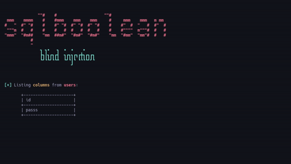

# PoC - Database Dumping Exploiting SQL Boolean Blind Injection

<!---
Lenguaje: Bash
-->     

## What is SQL Boolean Blind Injection and How Does It Work? 

A SQL Boolean Blind Injection is a type of SQL injection categorized as "blind" because the attacker cannot directly view the data returned by the server. Instead, the attacker manipulates the SQL query to create a boolean condition that results in a "true" or "false" response. These responses can be indirectly observed through specific indicators, such as the HTTP status code, the Content-Length of the server's response, or even visible messages on the web page. By leveraging these boolean signals, the attacker can perform iterative tests to confirm or reject conditions, gradually extracting sensitive information from the database. While this method may be slower than other injection techniques, it is highly effective when more direct approaches are blocked.

## Check if a field is vulnerable

This script checks if a web application parameter is vulnerable to SQL Boolean Blind Injection by sending crafted requests and analyzing the responses to pinpoint potential exploitation points.

## How an Attacker Can Dump a Database by Exploiting Boolean-Based Blind Injection 

Since we cannot directly observe the database's processed responses, alternative methods must be used to retrieve information. If input sanitization prevents the use of quotes, we can craft nested queries that leverage functions like ASCII to compare responses against decimal representations of specific characters.

If an attacker can obtain boolean responses based on whether a query evaluates to true or false, they could construct queries to isolate individual characters from the database. By iteratively comparing these characters to their decimal values, the attacker can gradually reconstruct the database's content, making this method exceptionally dangerous in the hands of a malicious actor.

## Lab Explanation 

This repository also includes the PHP file to replicate the lab. The file connects to the MySQL database and runs simple queries, providing an environment to test and understand how this exploitation method works.

## Exploitation

The exploitation process begins with the execution of an initial function that determines the type of payload to be used for injecting SQL queries. This function establishes a baseline for the script and checks whether the server is susceptible to SQL injections by looking for a boolean response that confirms the presence of the vulnerability.

Once this basic connection is established, the script’s flow moves to the **`dump_tables`** function, which is responsible for extracting specific information from the vulnerable database. At this stage, the script performs a series of iterations using **blind boolean injection** techniques.

### Listing Tables

To list the tables in the database, the script runs a query that uses the `ASCII(SUBSTRING(...))` function to obtain the ASCII value of each character in the table names. Instead of directly injecting characters like quotes or symbols that could be blocked by sanitization mechanisms, the script uses **decimal** values. By doing so, the script bypasses security measures designed to prevent the injection of dangerous characters.

The process follows an iterative flow where the script tests each character in the table names, incrementing the **offset** counter and obtaining the value of each character one by one. If the character retrieved is valid (i.e., it corresponds to a character that the server returns in the boolean response), the script continues adding the next character to the table name and repeats this process until the name of each table is fully reconstructed.

### Listing Columns

Once the script has identified all the tables in the database, the flow continues to extract the names of the **columns** in each table. Similar to the tables, the script uses an analogous injection technique, iterating over the characters of the column names in the same manner. The queries are constructed using `ASCII(SUBSTRING(...))` to retrieve each character in **decimal**, which ensures that even if the input parameter is sanitized to avoid quotes or special characters, the injection can still be executed.

Throughout this process, the script continuously checks whether the value retrieved corresponds to an expected character. If the correct character is found, the script appends that value to the column name and moves on to the next character, repeating this cycle for every column in each table until the entire list of columns in the database is retrieved.

### Technical Characteristics and Limitations

This workflow allows the attacker to progressively obtain the entire database structure, including table and column names. What makes this approach particularly effective is the ability to bypass common input sanitizations, as the character values are represented in **decimal**. This makes it harder to detect and mitigate the injection, even on systems with basic security measures.

It is important to note that although in this proof of concept only the names of tables and columns were extracted, the same principle can be applied to extract the entire database, including the data stored in each column, which could result in a full database dump.

This method is highly scalable, meaning it can be applied to databases of any size, as long as the database schema is compatible with queries to the **`information_schema`** table, which is standard in MySQL systems.

## Final Report: Data Extracted from the Database Using This Method 

The information gathered during the proof of concept is saved in a text file called **database_information.txt**. This file contains the data extracted from the database using the SQL injection method employed in the lab.

